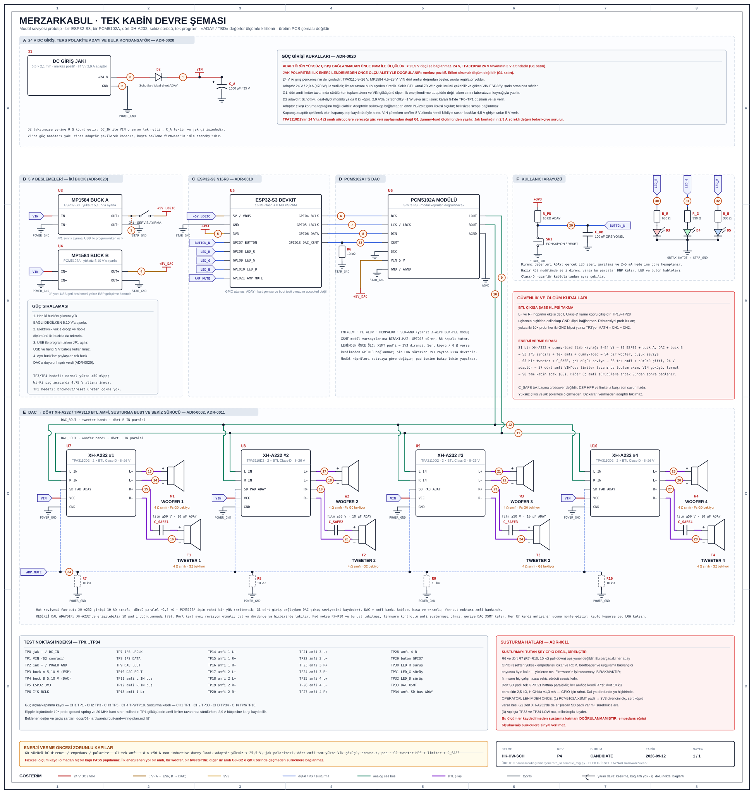
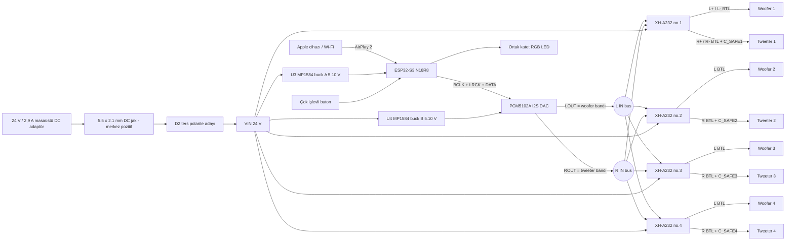
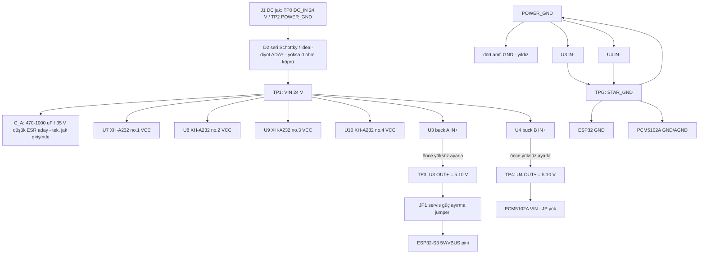
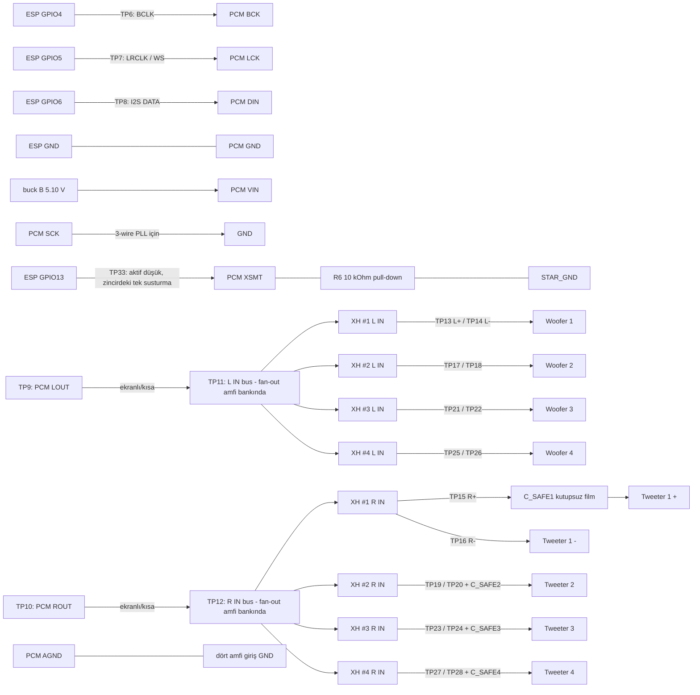
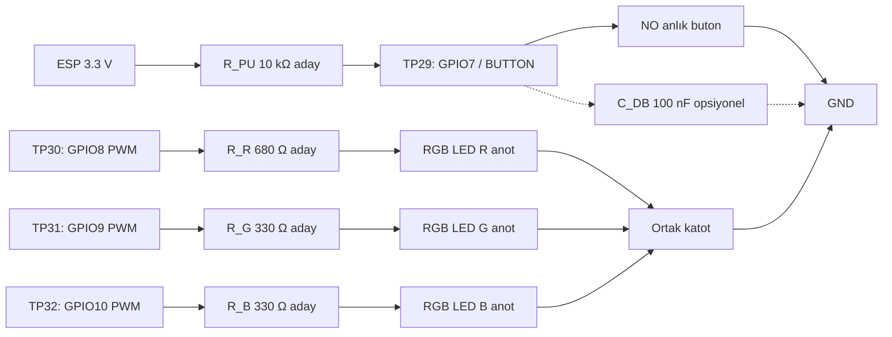
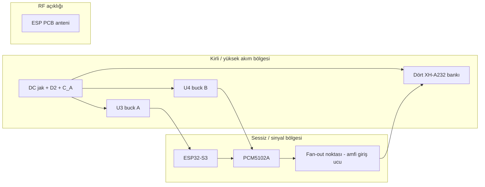
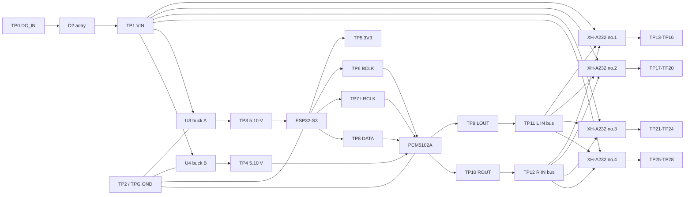
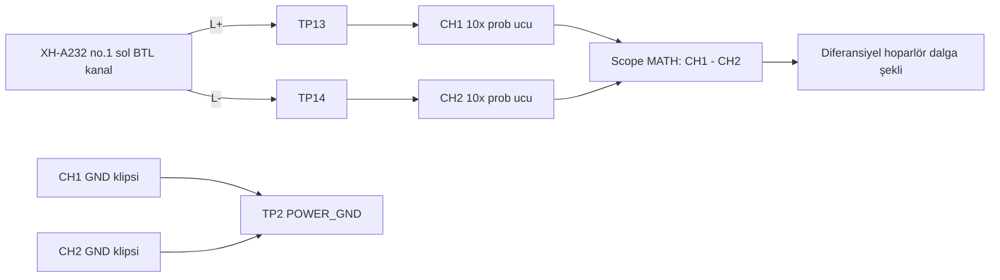

# Devre ve bağlantı şemaları

Bu belge **tek Merzarkabul kabini** için modül-temelli prototip bağlantı planıdır: sekiz sürücü, dört XH-A232, bir ESP32-S3, bir PCM5102A ([[../07-decisions/ADR-0021-single-cabinet|ADR-0021]], [[../07-decisions/ADR-0002-biamp-signal-chain|ADR-0002]]). Şema, özel üretim PCB şeması değildir; modüllerin gerçek baskı yazıları ve süreklilik ölçümleri görülmeden kablo bağlanmaz.

> [!danger] Enerji verme yasağı
> Nova woofer/tweeter değerleri G0 ile ölçülmeden gerçek sürücülere tam güç uygulanmaz. XH-A232 önce akım sınırlı laboratuvar kaynağı ve dummy-load ile G1 testinden geçer. Tweeter, `C_SAFE` seri koruma kondansatörü ile DSP HPF/limiter doğrulanmadan bağlanmaz. Enerji verilen ilk yol **bir amfi, bir woofer ve bir tweeter**'dır; diğer üç amfi sürücülere ancak G0-G2 o çift üzerinde geçince bağlanır.

## Devre şeması



Tek sayfalık pafta; DC giriş jakı ve 24 V / 2,9 A adaptör, ters polarite adayı ve bulk kondansatör, iki 5 V buck (A: ESP32-S3, B: PCM5102A), ESP32-S3 N16R8, PCM5102A, `LOUT`/`ROUT`'un dört XH-A232 girişine dağıtımı, dört woofer ve dört `C_SAFE` korumalı tweeter, kullanıcı arayüzü, GPIO13 DAC susturma hattı ve `TP0-TP33` ölçüm noktalarını gösterir. Ölçeklenebilir SVG'dir; Obsidian ve GitHub üzerinde doğrudan açılır.

Pafta `hardware/diagrams/generate_schematic_svg.py` ile üretilir ve elle düzenlenmez. Bu çizim modül-temelli prototip içindir; üretim PCB şeması yerine geçmez.

### Düzenlenebilir KiCad paftası

Netlist, ERC ve ileride PCB için elektriksel kaynak KiCad projesidir: [[kicad-schematic|KiCad şeması ve üretim scripti]]. Script `hardware/kicad/` altında Git'te tutulur. Üretilen `.kicad_sch` ve `.kicad_pro` **depoda yok**: bu makinede KiCad sembol kütüphaneleri kurulu olmadığı için `kicad-sch-api` çözemediği bir sembolü yerleştirmeyi reddediyor ve üreteç burada **hiç çalışmıyor**, yalnız `--validate` değil. Yani ERC ve PDF çıktısı alınmadı; üreteçteki yapısal self-check ayrı olarak koşturulmadan pafta doğrulanmış sayılmaz. Pafta depoda yokken `scripts/check_generated_kicad.py` bunu bir notla geçer; pafta yeniden üretilip eklendiğinde üreteç ile çıktının ayrışmasını CI'da yakalar. Geri getirme komutları `hardware/kicad/README.md` içinde.

İki çıktı bilerek ayrıdır: SVG paftası okunabilirlik ve bring-up prosedürü için, KiCad paftası elektriksel doğrulama için tutulur. İkisi de aynı net adlarını ve aynı `TP0-TP33` numaralandırmasını kullanır.

## 1. Sistem bağlantı özeti



## 2. DC giriş ve ana güç dağıtımı

Besleme topolojisi [[../07-decisions/ADR-0020-dc-adapter-power|ADR-0020]] ile kilitlidir: 24 V / 2,9 A (yaklaşık 70 W) masaüstü DC adaptör, kabine **5,5 × 2,1 mm merkez pozitif** barrel jak üzerinden girer ve jaktan gelen ray `VIN` adını taşır. `VIN` dört amfiyi doğrudan besler; TPA3110'un 8-26 V ve MP1584'ün 4,5-28 V giriş pencereleri 24 V'u içerir ve 26 V tavanına 2 V kalır. **V1'de güç anahtarı yoktur**: cihaz adaptörü çekilerek kapatılır, boşta beklemeyi firmware'in idle standby'ı karşılar.

İki `G1` kuralı adaptörün kendisiyle ilgilidir ve etiket okumakla geçilemez:

- **Yüksüz çıkış, bağlanmadan önce ölçülür.** Adaptörün ucu kabine takılmadan DMM ile okunur; `25,5 V`'un altında değilse bağlanmaz. 2 V'luk pay tolerans ve yüksüz yükselmeye gider; sınırı aşan adaptör derate edilmez, reddedilir.
- **Merkez pozitiflik** satın alınan adaptör ve jak üzerinde ölçü aletiyle doğrulanır.

Adaptör `2,9 A` ile verilidir; tahmin edilecek olan onun akımı değil, ona sığacak seviyedir. Sekiz BTL kanal 70 W'ın çok üstünü çekebilir ve çöken `VIN` ESP32-S3'ü şarkı ortasında sıfırlar; bu yüzden **limiter tavanı bu bütçeden türetilir** ve `G1`, dört amfi birlikte limiter tavanında sürülürken toplam akımı ve `VIN` çöküşünü ölçer. İlk enerjilendirme yine adaptörle değil, akım sınırlı laboratuvar kaynağıyla yapılır.

### 2.1 Ana güç dağıtımı



- `D2` ters polarite koruması **adaydır**: seri Schottky, ideal-diyot modülü ya da hiçbiri. Kararı `G1`'de ölçülen ileri düşüm ve ısınma verir; takılmazsa yerine 0 Ω köprü gelir ki `DC_IN` ile `VIN` tek net olsun. 2,9 A'da bir Schottky yaklaşık 1 W veya üstü ısınır; bu, köprü sonucunu güçlendirir ama kararı değiştirmez. Şemada parça olarak durur, çünkü bir not sipariş edilemez ve denetlenemez.
- Lojik tarafını **iki ayrı buck** besler: `U3` (buck A) ESP32-S3'ü, `U4` (buck B) PCM5102A'yı. Ayrılmalarının sebebi tezgâhta duyulan bir şeydir: paylaşılan tek buck DAC'a duyulur hışırtı verdi (sahibin gözlemi, ADR-0020; düzenek ayrıntısı kaydedilmedi, bu bir kapı geçişi değildir). İki buck'ın çıkışı da yük bağlı değilken `5,10 V`'a ayarlanır, sonra elektronik yükle doğrulanır.
- ESP32 USB ile programlanırken `JP1` açılır. Geliştirme kartının USB ile harici `5 V` hattını güvenle OR'ladığı kanıtlanmadıkça iki kaynak aynı anda bağlanmaz. Buck B'de `JP` yoktur: USB geri beslemesi yalnız ESP geliştirme kartında vardır.
- Bulk kondansatör `C_A` tektir ve jak girişindedir: `470-1000 µF / 35 V` düşük-ESR aday. 24 V rayda 25 V sınıfı kabul edilmez; gerilim sınıfı adaptörün yüksüz çıkışının üstünde olmalıdır. Amfi başına ek bulk yalnız `G1` ripple ölçümü isterse eklenir.
- Adaptörün çıkışı koruma toprağına bağlı olabilir. Adaptörle çalışırken osiloskop bağlamadan önce §7.3'teki izolasyon ölçümü yapılır.

## 3. ESP32-S3 -> PCM5102A -> 4 × XH-A232 ses zinciri

### 3.1 Aday ESP32-S3 pin planı

Bu GPIO tablosu [[../07-decisions/ADR-0010-esp32-s3-n16r8-board|ADR-0010]] ile kilitlenen ESP32-S3 **N16R8** (16 MB flash + 8 MB PSRAM) kartı için **prototip adayıdır**. Kart seçimi `accepted`, pin ataması `candidate`: satın alınan kartın şeması ve boot testi görülmeden pin tablosu `accepted` yapılmaz.

| İşlev | ESP32-S3 aday GPIO | Modül ucu | Not |
|---|---:|---|---|
| I2S BCLK | GPIO4 | PCM5102A `BCK` | Kısa ve GND referanslı kablo |
| I2S LRCLK/WS | GPIO5 | PCM5102A `LCK/LRCK` | Kanal saat sinyali |
| I2S DATA OUT | GPIO6 | PCM5102A `DIN` | ESP -> DAC tek yön |
| DAC SCK/MCLK | Bağlanmaz | PCM5102A `SCK` -> GND | 3-wire BCK-PLL modu; modül jumperı doğrulanır |
| Fonksiyon butonu | GPIO7 | Buton -> GND | Active-low; 10 kΩ pull-up aday |
| RGB kırmızı | GPIO8 | `R_R` -> LED R | PWM |
| RGB yeşil | GPIO9 | `R_G` -> LED G | PWM |
| RGB mavi | GPIO10 | `R_B` -> LED B | PWM |
| DAC susturma | GPIO13 | PCM5102A `XSMT` | **Aktif düşük.** `R6` 10 kΩ pull-down zorunlu. Bağlamadan önce modül köprüsü ölçülür, bkz. §3.3. Zincirdeki **tek** susturma: XH-A232'de susturma girişi yoktur, bkz. §3.4 |

Tablo [[../07-decisions/ADR-0011-audio-side-gpio-reservation|ADR-0011]] ile genişletildi. Sekiz GPIO'nun tamamı `firmware/components/hk_pins/include/hk_pins.h` içinde aynı numaralarla tanımlıdır ve host testi bu tabloyu işlev işlev doğrular.

`GPIO14-17` bilerek boş bırakıldı. Serbest pinler arasında hem RTC yetenekli hem de strapping/USB/UART0/JTAG rolü olmayan tek dörtlü onlar, yani susturma hattının yedek havuzu.

`GPIO6` ürünün dışında ikinci bir işe daha koşuluyor: tezgâhtaki geliştirme kartında S/PDIF çıkışı aynı pinden sürülüyor, bkz. 3.5. Ürün kablolamasında bu pin yalnız `DIN`'e gider.

Sıralamanın kendisi `firmware/components/hk_audio/` içinde yazılı ve host'ta test edilmiş: açarken önce saat, saat oturunca DAC; kapatırken **önce DAC susturulur**, saat DAC'ın yumuşak susturma rampası bitene kadar tutulur. Amfide sıralanacak bir şey yoktur: XH-A232'nin susturma girişi yok, dört amfi `VIN` geldiği andan itibaren canlıdır ve DAC'ın verdiği her şeyi kazançla sürücüye taşır. TPA3110'un kendi açılış/kapanış geçişi bu yüzden firmware'in erişemediği bir şeydir; adaptör takılırken ve çekilirken ne kadar pop ürettiği `G1`'in kaydına girer (§7).

**Susturma hattındaki pull-down opsiyonel değildir; susturma mekanizmasının kendisidir.** Bu parçadaki her GPIO reset'ten yüksek empedanslı çıkar ve ROM, bootloader ve uygulama başlangıcı boyunca öyle kalır — yüzlerce milisaniye. O pencerede DAC'ı susturan tek şey harici dirençtir, ve amfiler o pencerede zaten canlı olduğundan sekiz sürücüyü sessiz tutan tek şey de odur. Yazılımın işi susturmayı **bırakmaktır**; firmware hiç çalışmazsa DAC susturulu, sekiz sürücü sessiz kalır.

Bu direncin referans numarası `R6` (`XSMT` → `STAR_GND`); BOM'da ve iki şema üretecinde çizili bir parçadır. 2026-09-08'e kadar değildi: firmware (`firmware/components/hk_audio/`) pini açılıştan itibaren sürüyordu ama şemada pin uçsuz etiketti, PCM5102A blokunda `XSMT` pini hiç yoktu ve pull-down yalnız bir notta geçiyordu. Bir notun sipariş edilmesi, lehimlenmesi veya denetlenmesi mümkün değildir.

`R6` **modül ucuna** monte edilir, ESP ucuna değil. Uçan kablo koparsa pad kendi pull-down'unu görmeye devam eder; direnç ESP ucunda olsaydı kopan kablo pad'i serbest bırakırdı.

`GPIO18/19/20` susturma hattı olamaz: silikon bunları açılışta HIGH sürer. `GPIO0/39/43/44` de olamaz: zayıf dahili pull-up ile açılırlar. İkisi de yazılım var olmadan DAC'ı canlı amfilere açardı.

Kaçınılan pinler: boot/strapping `GPIO0/3/45/46`, native USB `GPIO19/20`, SPI flash `GPIO26-32`, **oktal PSRAM `GPIO33-37`** (N16R8'in R8'i), UART0 konsolu `GPIO43/44`, ve S3 die'ında var olmayan `GPIO22-25`. Tamamı `hk_pins.h` içinde derleme zamanında reddedilir — ESP-IDF bu kart yapılandırmasında `GPIO33-37`'yi rezerve **etmez**, gerekçesi ADR-0011'de. Kesin kart farklıysa tablo yeniden hazırlanır.

### 3.2 I2S ve analog bağlantı



### 3.3 PCM5102A modül ayarları

Mor PCM5102A modül ailesinde kontrol padleri genellikle `FLT`, `DEMP`, `XSMT`, `FMT` olarak çıkar. Modül revizyonu süreklilik ölçümüyle doğrulandıktan sonra başlangıç hedefi:

| Sinyal | Başlangıç hedefi | Amaç |
|---|---|---|
| `SCK` | GND | 3-wire I2S; saat BCK üzerinden dahili PLL |
| `FMT` | LOW | Standart I2S formatı |
| `FLT` | LOW | Normal latency filtre |
| `DEMP` | LOW | De-emphasis kapalı |
| `XSMT` | **`R6` ile LOW tutulur, GPIO13 sürer** | Açılışta DAC susturulmuş; susturmayı firmware bırakır ([[../07-decisions/ADR-0011-audio-side-gpio-reservation\|ADR-0011]]) |

Bu satır 2026-09-08'e kadar "HIGH / kart varsayılanı" diyordu. O okuma kabul edilmiş ADR-0011 ile, yukarıdaki 3.1 pin tablosuyla, BOM'un `R6` satırıyla ve pini açılıştan itibaren süren firmware ile çelişiyordu; dördü de aynı şeyi söylediği için düzeltilen taraf bu satır oldu. Karar ADR-0011'dir ve **modül varsayılanı kullanılmaz**: varsayılan "sesi aç" demektir ve tam olarak yazılımın var olmadığı pencerede geçerlidir.

PCM5102A çipi harici SCK olmadan BCK PLL ile çalışabilir. Ancak modülün altındaki lehim köprüleri satıcıdan satıcıya farklı olabilir; pad ismine bakıp körlemesine lehim yapılmaz.

> [!danger] `XSMT` pad'i, GPIO13 bağlanmadan önce ölçülür
> Mor modüllerin bir kısmında `XSMT` pad'i kart üzerinde 3,3 V'a **sert bağlıdır** (lehim köprüsü veya 0 Ω). O durumda 10 kΩ pull-down hiçbir şey tutmaz — yalnız bir bölücü kurar, pad HIGH kalır — ve GPIO13 pini LOW sürdüğü anda 3,3 V rayına kısa devre olur. Yani bu ölçüm atlandığında hem susturma çalışmaz hem de ESP pini zorlanır.
>
> Operatör sırası, modül **enerjisizken**:
>
> 1. `XSMT` pad'i ile modülün `VIN`/3,3 V ucu arasındaki direnci ölç. Kaydet.
> 2. Değer birkaç yüz Ω'un altındaysa köprü vardır: köprüyü kes ve kesildiğini aynı ölçümle doğrula.
> 3. `R6`'yı modül ucuna, pad'in yanına lehimle. `R6` ile `GND` arasında 10 kΩ okunmalı.
> 4. GPIO13'ü ancak bundan sonra bağla.
> 5. İlk enerjilendirmede `TP33`'ü osiloskopla kaydet: reset anından firmware susturmayı bırakana kadar LOW kalmalı.
>
> Adım 1, 3 ve 5 ölçüm kaydı olmadan susturma katmanı doğrulanmış sayılmaz; kaydı operatör [[../06-testing/test-strategy|test kaydına]] yazar. Aynı köprü riski `FMT`, `FLT` ve `DEMP` için de geçerlidir, ama onlarda yanlış sonuç ses formatıdır, susturmanın kaybı değildir.

### 3.4 Kanal ve sürücü kuralları

- Firmware sol dijital kanalı `woofer` bandı, sağ dijital kanalı `tweeter` bandı olarak üretir; DSP zinciri (mono L+R toplamı, bant başına EQ, subsonic yüksek geçiren, LR4 crossover, dal başına limiter) çalışır, sayıları `G0`/`G2` ölçümlerini bekler. Tek program vardır, stereo yoktur (ADR-0021).
- Dört amfi aynı hat seviyesi sinyali paralel alır: `LOUT` dördünün `L IN`'ine, `ROUT` dördünün `R IN`'ine. XH-A232 girişi 10 kΩ sınıfıdır; dördü paralel yaklaşık 2,5 kΩ eder, PCM5102A'nın hat çıkışı için rahat bir yüktür. Bu bir aritmetiktir; `G1` dört giriş bağlıyken DAC çıkış seviyesini ve bozulmayı kaydeder.
- Dört amfi özdeştir ve kazançları `G1`'de eşleştirilir: TPA3110'un kazanç seçimi dört kartta da okunur ve aynı olduğu yazılır; aynı kabinde kazanç farkı duyulur.
- XH-A232 `L+ / L-` ve `R+ / R-` çıkışları BTL'dir. Hiçbir `-` hoparlör ucu GND/şaseye bağlanmaz.
- `C_SAFE` tek başına crossover değildir; DSP HPF ve limiter'a karşı son savunma katmanıdır. Dört adet, her tweeter'a kendi `C_SAFE`'i (`C2`-`C5`).
- `C_SAFE` ilk değeri **10 µF kutupsuz film, ≥ 50 V** olarak seçildi ([[driver-measurements|sürücü ölçüm planı]], 2026-09-08): `C = 1 / (2π × R_tweeter × f_safe)` ile 4 Ω'da yaklaşık 4 kHz köşe. Tweeter `Fs` ölçülene kadar adaydır; kesin değer G2 test raporuna girer.
- Amfi kanal eşlemesi kabin içinde etiketlenir (amfi 1-4, woofer 1-4, tweeter 1-4); firmware ve kablo aynı sürüm numarasını taşır.

> [!warning] Amfide susturma girişi yoktur; zincirdeki tek susturma DAC'tır
> XH-A232 kartında güç girişi, ses girişi ve hoparlör çıkışları dışında hiçbir bağlantı yoktur (sahibin kart üzerindeki tespiti, 2026-09-12). TPA3110'un `SD` bacağı kart üzerinde dışarı çıkarılmamıştır; bu yüzden firmware kontrollü bir amfi susturması **yoktur** ve olmayacaktır. Tek katman DAC `XSMT`'dir: sinyali keser, ama TPA3110'un kendi açılış/kapanış geçişini kesmez. `hk_audio` sıralaması bu yüzden iki hat sürer — I2S saati ve `XSMT` — ve amfi için bir adım içermez.
>
> Bunun bedeli iki ölçüm satırıdır. Adaptör takılırken ve çekilirken dört amfinin kendi pop'u `G1`'de kaydedilir (§7); DAC susturuluyken bile duyulan bir pop amfinin kendisinindir ve firmware'in yapabileceği bir şey yoktur. Duyulur bir pop, `VIN` tarafında bir donanım önlemi isterse o ayrı bir ADR'dir; bugün böyle bir önlem yoktur.
>
> Dört kart aynı revizyon olmak zorundadır: aynı kabinde kazanç farkı duyulur.

### 3.5 S/PDIF tezgâh çıkışı — ürün kablolamasında yoktur

> [!warning] Bu üç parça kabine girmez
> Ürünün ses yolu [[../07-decisions/ADR-0002-biamp-signal-chain|ADR-0002]] ile I2S -> PCM5102A -> 4 × XH-A232'dir ve öyle kalır. Aşağıdaki devre yalnız geliştirme kartında, kullanıcının kendi harici DAC'ına bağlanmak içindir. BOM'a, kabin içi kablo demetine ve `TP` numaralandırmasına dahil değildir.

Neden var: geliştirme kartında PCM5102A yok (ADR-0012) ve sipariş edilen modüller gelmedi, yani I2S'in üç pini hiçbir şeye sürüyordu — zincirin duyulabilir hiçbir çıktısı olmuyordu. Vendor edilen alıcı `audio_output_spdif.c` taşıyor: BMC (biphase-mark) kodlamasını modern `i2s_std` sürücüsü üzerinden bit-bang edip tek veri pininden gerçek bir S/PDIF akışı üretiyor. Bit ve kelime saati dışarı hiç çıkmaz. Açılışta `SPDIF output ready rate=44100x2 dma=192x2` satırı görülür; buradaki `x2` BMC'nin iki katına çıkardığı bit hızıdır, örnekleme oranı değil. 2026-09-05'te bir FiiO Q15'in coax girişi 44.1 kHz'e temiz kilitlendi ve ses duyuldu; ham kayıt [[../06-testing/devkit-bring-up|geliştirme kartı bring-up notundadır]].

**Pin çakışması bu bölümün asıl uyarısıdır.** Çıkış, 3.1 tablosunda `I2S DATA OUT` olarak duran `GPIO6`'dır: ADR-0011 o pini ses verisine ayırmıştı ve `hk_airplay.c` seçimi derleme anında `hk_pins`e karşı doğruluyor. S/PDIF, I2S'in yanına eklenmez, **yerine geçer**. Bu çıkış etkinken `BCLK` ve `LRCLK` sürülmez; aynı anda bir PCM5102A beslenemez.

Arayüz üç pasif parçadır. Şartname 75 Ω yükte `0.5 V ±%20` tepe ister, yani `0.4-0.6 V`; GPIO ise 3.3 V sallar. `R1/R2` bölücüsü hem seviyeyi indirir hem kaynak empedansını 75 Ω'a yaklaştırır, `100 nF` DC'yi keser:

```text
GPIO6 --[R1]--+--[100 nF]-- coax merkez
              |
            [R2]
              |
GND ----------+------------ coax toprak
```

| R1 / R2 | 75 Ω yükte tepe | Kaynak Z | Not |
|---|---:|---:|---|
| 210 Ω / 110 Ω | 0.578 V | 72.2 Ω | Vendor edilen dosyanın kendi değeri; %1 seri gerekir |
| 220 Ω / 120 Ω | 0.572 V | 77.6 Ω | E24; kaynak empedansı 75 Ω'a en yakın olan |
| 220 Ω / 100 Ω | 0.538 V | 68.8 Ω | E24 |
| 270 Ω / 150 Ω | 0.516 V | 96.4 Ω | E24; seviye içeride, kaynak Z 75 Ω'dan uzak |
| 330 Ω / 100 Ω | 0.379 V | — | **Kullanma**; şartnamenin 0.4 V tabanının altında |

Son satır tabloya bilerek konuldu: `330/100` bu iş için yaygın olarak önerilir ve tepe değeri şartnamenin alt sınırının altında kalır. Bir DAC onunla kilitlenebilir de kilitlenmeyebilir de; kilitlenirse bu alıcının tolerans payıdır, devrenin doğruluğu değil. Direnç kutusunda `210/110` yoksa `220/120` alınır.

Akış 44.1 kHz / 16 bit'te sabittir. Bunun nedeni bu kart değildir ve firmware ayarıyla yükseltilemez; gerekçesi bring-up notundadır.

Bu çıkış hiçbir fiziksel kapıyı ilerletmez: dönüşümü kullanıcının kendi DAC'ı yapar ve bilinmeyen bir sürücüye enerji verilmez. Bölüm başındaki enerji verme yasağı ile G0-G2 sırası aynen geçerlidir.

## 4. Buton ve RGB LED



- ESP32 dahili pull-up kullanılabilir; harici `10 kΩ` gürültülü kabin ortamında başlangıç adayıdır.
- `100 nF` donanımsal debounce opsiyoneldir; firmware yine 50 ms debounce uygular.
- LED dirençleri gerçek LED ileri gerilimi ve hedef 2-5 mA akıma göre hesaplanır. Hazır RGB modülde direnç varsa harici dirençler yeniden değerlendirilir.
- LED ve buton kabloları Class-D hoparlör kablolarından ayrılır.

## 5. Kablo demeti ve konnektör planı

Konnektör numaraları KiCad üreteciyle aynıdır: `J1` jak, `J2`/`J3` amfi 1'in woofer/tweeter'ı, `J4`/`J5` amfi 2, `J6`/`J7` amfi 3, `J8`/`J9` amfi 4. Şemada parça olmayan kablo demetleri numarasızdır.

| Bağlantı | Pinler | Öneri |
|---|---|---|
| J1 DC giriş | `DC_IN`, `POWER_GND` | 5,5 × 2,1 mm panel tipi barrel jak; merkez pozitif ölçü aletiyle doğrulanır; kontak akımı 2,9 A sürekli, belgeli değer tedarikçiden istenir |
| Güç dağıtımı | `VIN`, `POWER_GND` | Jaktan dört amfi ve iki buck'a yıldız dağıtım; kablo kesiti 2,9 A'e göre |
| I2S demeti | `GND`, `BCK`, `LCK`, `DIN` | GND-sinyal eşleşmeli, kısa; hoparlör çıkışından uzak |
| DAC analog fan-out | `LOUT`, `AGND`, `ROUT` | DAC'tan amfi bankına kısa ekranlı kablo; fan-out noktası (dört `L IN`, dört `R IN`) amfi bankındadır, DAC ucunda değil; ekran tek uç/topoloji G1 gürültü ölçümünde test edilir |
| Buck A → ESP | `+5V_LOGIC`, `STAR_GND` | `JP1` üzerinden; USB ile programlarken açılır |
| Buck B → DAC | `+5V_DAC`, `STAR_GND` | `JP` yok; DAC analog çıkışından uzak çekilir |
| J2 / J4 / J6 / J8 woofer 1-4 | `L+`, `L-` | Bükümlü çift, polarize; amfi numarası etiketli |
| J3 / J5 / J7 / J9 tweeter 1-4 | `R+ -> C_SAFE`, `R-` | Bükümlü çift, woofer'dan farklı anahtar/konnektör ile yanlış takma önlenir; `C_SAFE` amfi ucunda |
| UI demeti | `3V3`, `BUTTON`, `LED_R/G/B`, `GND` | Düşük akım, güç/speaker kablolarından ayrı |

## 6. Fiziksel yerleşim



- PCB anteninin önünde metal veya kablo demeti bırakılmaz.
- İki MP1584 indüktörü ve dört XH-A232'nin çıkış indüktörleri PCM5102A analog ucundan uzak tutulur; buck B, beslediği DAC'ın analog çıkışına yakın değil, giriş ucuna yakın durur.
- DAC amfi bankına yakın yerleşir; analog kablo kısa kalır ve fan-out amfi tarafında yapılır. Analog ses kablosu hoparlör çıkış kablolarıyla paralel uzun mesafe gitmez.
- Güç ve analog dönüşler gelişigüzel zincirlenmez; dört amfinin dönüşü `POWER_GND` yıldızına, buck B'nin dönüşü DAC `AGND`'ye tek noktadan gider. `STAR_GND` noktası G1 gürültü ölçümünde belirlenir.
- Adaptör kabinin dışındadır; kabine yalnız jak girer. Elektronik bölme akustik hacimden ayrılır ve kablolar pasif radyatör/woofer hareket alanına girmez ([[../04-acoustics/cabinet-plan|kabin planı]]).

## 7. Test noktaları ve osiloskop planı

### 7.1 Test noktası yerleşimi

PCB veya kablo dağıtım kartında test noktaları iğne probla erişilebilir, kısa devre oluşturmayacak aralıkta ve ipek baskıda `TPx` adıyla işaretlenir. Güç test noktalarında halka/klips tipi, hızlı dijital ve analog ses noktalarında küçük pad kullanılır. Numaralandırma tek tablodur: burası, SVG paftası ve KiCad üretecinin `TEST_POINTS` tablosu aynı sayıları taşır.

| TP | Konum | Referans | Beklenen değer / dalga | Araç ve ilk kontrol |
|---|---|---|---|---|
| TP0 | DC jak `+` / `DC_IN` | TP2 | 24 V DC nominal; adaptör etiketi ± %5; yüksüz çıkış bağlanmadan önce < 25,5 V ölçülmüş | DMM; **ilk enerjilendirmeden önce** polarite: merkez pozitif |
| TP1 | `VIN` (`D2` sonrası) | TP2 | TP0 eksi `D2` ileri düşümü; köprüyse TP0 ile aynı | DMM yükte; `TP0-TP1` mV düşüm ve `D2` ısısı G1 kaydına; dört amfi limiter tavanında sürülürken çöküş kaydı |
| TP2 | DC jak `−` / `POWER_GND` | TP2 | 0 V yük referansı | DMM/scope ground referansı |
| TP3 | `U3` buck A 5 V çıkışı (ESP32-S3) | TPG | 5.10 V ayar; hedef 5.00-5.20 V | DMM + scope; yükte droop/ripple |
| TP4 | `U4` buck B 5 V çıkışı (PCM5102A) | TPG | 5.10 V ayar; hedef 5.00-5.20 V | DMM + scope; yükte droop/ripple; DAC hattında hışırtı |
| TP5 | ESP32 kart 3V3 | TPG | Taslak hedef 3.15-3.45 V | DMM + scope; brownout gözlemi |
| TP6 | I2S BCLK | TPG | 0-3.3 V; 44.1 kHz için 1.4112/2.8224 MHz veya 48 kHz için 1.536/3.072 MHz | Scope 10x; gerçek slot genişliğine göre |
| TP7 | I2S LRCLK/WS | TPG | 0-3.3 V; 44.1 veya 48 kHz | Scope/logic analyzer |
| TP8 | I2S DATA | TPG | 0-3.3 V veri | Scope/logic analyzer |
| TP9 | PCM5102A LOUT | PCM AGND | Woofer bandı; 0 dBFS'te çip sınırı yaklaşık 2.1 Vrms | Scope AC coupling; önce -40 dBFS |
| TP10 | PCM5102A ROUT | PCM AGND | Tweeter bandı | Scope AC coupling; önce -40 dBFS |
| TP11 | Amfi `L IN` bus (fan-out noktası) | giriş GND | TP9'a yakın; dört giriş paralelken seviye düşümü kaydedilir | Scope AC coupling |
| TP12 | Amfi `R IN` bus (fan-out noktası) | giriş GND | TP10'a yakın | Scope AC coupling |
| TP13/TP14 | Amfi 1 `L+` / `L-` | Birbirine diferansiyel | Woofer 1 BTL PWM + diferansiyel audio | Diferansiyel prob veya CH1-CH2 |
| TP15/TP16 | Amfi 1 `R+` / `R-` | Birbirine diferansiyel | Tweeter 1 BTL PWM + diferansiyel audio | Diferansiyel prob veya CH1-CH2 |
| TP17/TP18 | Amfi 2 `L+` / `L-` | Birbirine diferansiyel | Woofer 2 | Diferansiyel prob veya CH1-CH2 |
| TP19/TP20 | Amfi 2 `R+` / `R-` | Birbirine diferansiyel | Tweeter 2 | Diferansiyel prob veya CH1-CH2 |
| TP21/TP22 | Amfi 3 `L+` / `L-` | Birbirine diferansiyel | Woofer 3 | Diferansiyel prob veya CH1-CH2 |
| TP23/TP24 | Amfi 3 `R+` / `R-` | Birbirine diferansiyel | Tweeter 3 | Diferansiyel prob veya CH1-CH2 |
| TP25/TP26 | Amfi 4 `L+` / `L-` | Birbirine diferansiyel | Woofer 4 | Diferansiyel prob veya CH1-CH2 |
| TP27/TP28 | Amfi 4 `R+` / `R-` | Birbirine diferansiyel | Tweeter 4 | Diferansiyel prob veya CH1-CH2 |
| TP29 | Buton GPIO7 | TPG | Boşta yaklaşık 3.3 V, basılı 0 V | DMM/scope; debounce |
| TP30/31/32 | LED R/G/B anot sürüşü | TPG | 0-3.3 V PWM | Scope; PWM frekansı ve audio paraziti |
| TP33 | PCM5102A `XSMT` / GPIO13 | TPG | Reset anından firmware susturmayı bırakana kadar **LOW** (≤0,4 V); sonra 3,3 V | Scope single-shot, reset'ten tetikle; enerjisizken önce pad↔3V3 direnci (§3.3) |

`TP5` ESP32 geliştirme kartının gerçek `3V3` pininden alınır. Kart regülatörü ve USB güç topolojisi görülmeden 3V3 hattına harici enerji verilmez.

### 7.2 Test noktalarının şematik görünümü



### 7.3 Osiloskop güvenlik kuralları

> [!danger] BTL çıkışa şase klipsi takma
> Masa tipi osiloskopların prob GND klipsleri çoğunlukla koruma toprağına ve birbirine bağlıdır. `TP13`-`TP28` uçlarından hiçbirine GND klipsi takma. Bu uçlar “hoparlör eksi/GND” değildir; iki uç da Class-D yarım-köprü çıkışıdır ve bu dört amfinin sekiz kanalı için de geçerlidir.



Aynı amfinin sağ kanalında bağlantı `TP15=CH1`, `TP16=CH2` olarak tekrarlanır; amfi 2-4 için kendi dörtlü test noktaları kullanılır. Diferansiyel prob varsa prob doğrudan iki BTL ucu arasına bağlanır ve masa tipi tek uçlu prob yöntemine tercih edilir.

BTL ölçümü için tercih sırası:

1. Yeterli common-mode ve diferansiyel gerilim sınıfına sahip **diferansiyel probu** `L+ ↔ L-` veya `R+ ↔ R-` arasına bağla.
2. Diferansiyel prob yoksa iki aynı `10x` prob kullan: her iki probun GND klipsi yalnız `TP2 POWER_GND` noktasına; CH1 ucu `L+`, CH2 ucu `L-`; osiloskop matematiği `CH1 - CH2`. Sağ kanal için aynı yöntem.
3. Tek probu doğrudan hoparlör uçları arasına bağlama; probun şase klipsi çıkışa değmemeli.
4. Prob/osiloskop girişinin `VIN`, PWM overshoot ve common-mode gerilim sınırlarını karşıladığını doğrula.
5. Amfi testi adaptör yerine önce izolasyonu/toprak ilişkisi bilinen akım sınırlı laboratuvar kaynağıyla yapılır.
6. DC adaptör bağlıyken osiloskop kullanmadan önce adaptör çıkışının PE/toprak ve DUT ile izolasyon ilişkisini ölç; belirsizse adaptörle scope bağlama.

TP1/TP3/TP4 besleme ripple ölçümü:

- `10x` prob, ground-spring veya çok kısa GND bağlantısı kullan.
- `20 MHz bandwidth limit` aç; önce DC coupling ile seviye, sonra AC coupling ile ripple gözle.
- TP3 ve TP4 için ilk taslak hedef: normal yükte `≤50 mVpp`, Wi-Fi akım sıçramasında hiçbir `5 V` hattı `4.75 V` altına düşmemeli. Bunlar modül datasheet garantisi değil, G1 proje kabul hedefidir.
- TP5 için brownout/reset oluşturan çökme olmamalı; minimum değer kesin ESP32 kart ve brownout ayarıyla test raporunda kilitlenir.
- TP1 için adaptörle çalışırken bas tepesinde besleme çöküşü kaydedilir; dört amfi ve iki buck birlikte çektiğinde adaptörün 2,9 A sınırına girip girmediği bu kayıttan okunur. Limiter tavanı bu kayıtla doğrulanır.

### 7.4 Ses dalga şekli testi

Başlangıç test sinyali: `1 kHz`, önce `-40 dBFS`, ardından `-20 dBFS`. Tweeter bağlı değilken her iki DSP bandının seviyesi TP9/TP10'da, dört giriş bağlıyken TP11/TP12'de doğrulanır. Kademeler her amfi için ayrı ayrı yürütülür; ilk tur tek amfiyle (amfi 1) tamamlanır, diğer üç amfi A-D kademelerini sırayla geçer.

| Kademe | Yük | Ölçüm | Geçiş şartı |
|---|---|---|---|
| A | XH girişsiz | Her amfide `L+`-`L-` ve `R+`-`R-` (TP13-TP28) | Anormal DC/fault/ısınma yok |
| B | 8 Ω / en az 50 W non-inductive dummy-load | Diferansiyel 1 kHz çıkış | Önce 1.0 Vrms; temiz ve kararlı |
| C | 8 Ω dummy-load | Diferansiyel 2.83 Vrms | Yaklaşık 1 W; clipping yok; dört amfi arasında kazanç eşleşmesi kaydedilir |
| D | 8 Ω dummy-load | Kademeli Vrms + sıcaklık | Clipping ve termal sınır kaydedilir; sürücü yok |
| E | Bir woofer, düşük seviye (yalnız amfi 1) | Diferansiyel + akustik | G2 woofer koruması |
| F | Bir tweeter + `C_SAFE1`, çok düşük seviye (yalnız amfi 1) | TP10 ve diferansiyel R çıkışı | HPF/limiter ölçümle doğrulanmış |
| G | Dört amfi dummy-load'da birlikte, limiter tavanında | TP1 çöküşü, toplam akım, sıcaklık | 2,9 A aşılmıyor; ESP reset yok (G1 bütçe satırı) |

Dummy-load gücü `P = V_RMS² / R` ile hesaplanır. Osiloskop PWM'li ham BTL çıkışta yanlış RMS gösterebilir; diferansiyel prob, bant sınırı/filtre ve mümkünse true-RMS ölçüm veya audio analyzer ile çapraz kontrol edilir. TPA3110D2 tipik anahtarlama frekansı yaklaşık `310 kHz` olup veri sayfası aralığı `250-350 kHz`'dir; bu bileşen audio sinyali sanılmaz.

### 7.5 Güç açma/kapatma kaydı

Scope single-shot kaydı için kanallar:

- CH1: TP1 `VIN`.
- CH2: TP3 buck A `5.10 V` (ikinci koşuda TP4 buck B).
- CH3: TP5 `3V3`.
- CH4: TP9 veya TP10 DAC analog çıkışı.

Susturma hattı için **ayrı ve zorunlu** bir single-shot kayıt alınır: CH1 `TP1`, CH2 `TP33` (`XSMT`), CH3 `TP6` (`BCLK`), CH4 `TP9`/`TP10`. Tetik reset kenarındadır ve kaydın kapsaması gereken şey açılış penceresinin tamamıdır — ROM, bootloader ve uygulama başlangıcı. Beklenen: `XSMT` bu pencere boyunca LOW; DAC analog çıkışında adım yok; susturma yalnız firmware bıraktığında ve `BCLK` oturduktan sonra kalkıyor. Aynı dört kanalla bir de kapanış kaydı alınır: akış durduğunda `XSMT`'nin `BCLK` durmadan **önce** düştüğü ve DAC çıkışının saat kesilmeden önce sıfıra indiği görülmelidir; tersi, yumuşak susturma rampasının yarıda kesildiği anlamına gelir ve `mute_settle_ms` o kayda göre yükseltilir.

Kapanış V1'de adaptörün çekilmesidir; bu yüzden kapanış kaydı da adaptör çekilerek alınır, lab kaynağının çıkış düğmesiyle değil. Firmware `VIN`'i ölçmez ve çöküşü önceden göremez. Sıralamayı veren şey iki giriş penceresinin farkıdır: TPA3110 8 V'un altında kendi düşük gerilim kilidiyle susar, iki MP1584 ise 4,5 V girişe kadar 5 V vermeye devam eder; yani `VIN` çökerken dört amfi, DAC ve ESP hâlâ ayaktayken kapanır. Bu kayıt, o sıralamanın gerçekten böyle gerçekleşip gerçekleşmediğini ve pop olup olmadığını gösterir; besleme kaybında pop'suz kapanış G8'in kabul ölçütüdür.

Bu kayıt olmadan `G1` için "pop yok" denemez: pop'un olmaması, susturmanın çalıştığını değil yalnız o denemede duyulmadığını gösterir. Açılış/kapanışta DAC pop, amfi pop, ESP brownout ve rail sıralaması ayrıca kaydedilir. TPA3110D2 için en iyi power-off pop davranışı güç kesilmeden önce shutdown uygulanmasıdır; XH-A232 o bacağı dışarı çıkarmadığından bu yol yoktur (§3.4) ve amfinin adaptör takılıp çekilirken ürettiği pop, DAC susturuluyken, olduğu gibi kaydedilir.

## 8. Kademeli kurulum ve ölçüm planı

| Adım | Bağlanacaklar | Enerji kaynağı | Geçiş koşulu |
|---|---|---|---|
| S0 | Yalnız sürücü ölçümü | Enerjisiz | G0 verileri kayıtlı |
| S1 | Bir XH-A232 + dummy-load | Akım sınırlı lab kaynağı 8-24 V | G1 güç, DC offset, clipping, termal |
| S2 | ESP32 + buck A, DAC + buck B | Akım sınırlı lab kaynağı | İki 5 V ray ripple/brownout güvenli; DAC hattında hışırtı yok |
| S3 | ESP32 + PCM5102A + tek amfi + dummy-load | Lab kaynağı | I2S, bant eşleme, pop ve gürültü |
| S4 | Bir woofer, düşük seviye | Lab kaynağı | Woofer HPF/limiter güvenli |
| S5 | Bir tweeter + `C_SAFE`, çok düşük seviye | Lab kaynağı | G2 crossover/limiter doğrulandı |
| S6 | Tek amfi + sürücü çifti | 24 V adaptör | G1 adaptörle tekrar: yüksüz çıkış < 25,5 V, jak polaritesi, besleme çöküşü, pop, gürültü |
| S7 | Dört amfi `VIN`'de, dummy-load / sürücüler | 24 V adaptör | Limiter tavanında toplam akım ≤ 2,9 A, `VIN` çöküşü, termal (G1 bütçe satırı); dört amfi kazanç eşleşmesi |
| S8 | Tam kabin soak | 24 V adaptör | G8 kapalı kabin termal ve dayanıklılık |

Her adım için [[../templates/test-report|test raporu]] oluşturulur. Fiziksel ölçüm kaydı olmadan gate `PASS` yapılmaz. Dört amfi G0-G2 geçmeden birlikte sürülmez; diğer üç amfi sürücülere ancak S6'dan sonra bağlanır.

## 9. Açık kararlar

- [ ] Nova woofer ve tweeter empedans eğrisi ve `Fs` (DC dirençler ölçüldü: woofer 4,0 Ω, tweeter 3,5 Ω, ikisi de 4 Ω sınıfı).
- [ ] `C_SAFE` kesin değeri (ilk seçim 10 µF; tweeter `Fs` ile yeniden bakılır).
- [ ] Kesin ESP32-S3 kartı ve aday GPIO tablosunun boot/I2S doğrulaması.
- [ ] XH-A232 kartların dört fiziksel revizyonunun aynı olup olmadığı; aynı kabinde kazanç farkı duyulur.
- [ ] DAC `LOUT`/`ROUT`'un dört amfiye fan-out topolojisi: ekran, fan-out noktası ve dört giriş paralelken DAC çıkış seviyesi (G1).
- [x] XH-A232 kartında erişilebilir `SD/MUTE` noktası **yok** (sahibin tespiti, 2026-09-12: güç girişi, ses girişi ve hoparlör çıkışları dışında bağlantı yok). Firmware kontrollü amfi susturması yoktur; tek susturma DAC `XSMT`'dir (§3.4). Amfinin kendi açılış/kapanış pop'u `G1` kaydına girer.
- [ ] PCM5102A modülünde `XSMT` pad'inin 3,3 V'a sert bağlı olup olmadığı; köprü varsa kesilmesi (§3.3). `R6` takılıp `TP33` açılışta LOW ölçülene kadar susturma katmanı doğrulanmamıştır.
- [ ] 24 V / 2,9 A adaptör: marka/model, yüksüz çıkış < 25,5 V ölçümü, jak polaritesi, çıkışın PE/izolasyon ilişkisi.
- [ ] `D2` ters polarite koruması: Schottky, ideal-diyot modülü ya da 0 Ω köprü; 2,9 A sürekli akımda düşüm ve ısıyla G1'de karar.
- [ ] Jak kontağının 2,9 A sürekli akım değeri (tedarikçi sorusu), kablo kesiti ve konnektör akım sınıfı.
- [ ] USB ile harici 5 V arasında jumper, Schottky OR veya load-switch seçimi (yalnız buck A / ESP tarafı).

## 10. Teknik kaynaklar

- [TI PCM5102A veri sayfası](https://www.ti.com/lit/ds/symlink/pcm5102a.pdf): 3-wire I2S/BCK PLL, kontrol pinleri ve analog çıkış.
- [TI TPA3110D2 veri sayfası](https://www.ti.com/lit/ds/symlink/tpa3110d2.pdf): BTL çıkış, 8-26 V besleme, shutdown ve decoupling/layout.
- [XH-A232 modül referansı](https://www.taydaelectronics.com/tpa3110-xh-a232-digital-stereo-audio-power-amplifier-board.html): kart sınıfı, 8-26 V ve 4-8 Ω satıcı bilgisi; güç etiketi ölçüm yerine geçmez.
- [Seçilen PCM5102A satın alma kaynağı](https://www.aletler.com.tr/urun/pcm5102a-dac-modul): fiziksel modül revizyonu teslim alınınca karşılaştırılır.
- [Monolithic Power MP1584 veri sayfası](https://www.monolithicpower.com/en/documentview/productdocument/index/version/2/document_type/Datasheet/lang/en/sku/MP1584/document_id/204/): 4,5-28 V giriş penceresi; modül kalitesi ayrıca ölçülür.

## 11. İlgili belgeler

- [[audio-signal-chain|Ses sinyal zinciri]]
- [[driver-measurements|Sürücü ölçüm planı]]
- [[../04-acoustics/cabinet-plan|Kabin planı]]
- [[board-and-pin-selection|Kart ve pin seçimi]]
- [[grounding-emi-thermal|Topraklama, EMI ve termal]]
- [[../power-plan|Güç planı]]
- [[../controls-and-provisioning-plan|Kontroller ve provisioning]]
- [[../06-testing/test-strategy|Test kapıları]]
- [[../06-testing/devkit-bring-up|Geliştirme kartı bring-up kaydı]]
- [[../07-decisions/ADR-0002-biamp-signal-chain|ADR-0002 — Bi-amp sinyal zinciri: tek DAC, dört özdeş amfi]]
- [[../07-decisions/ADR-0010-esp32-s3-n16r8-board|ADR-0010 — Kanonik N16R8 kartı]]
- [[../07-decisions/ADR-0011-audio-side-gpio-reservation|ADR-0011 — Ses tarafı GPIO rezervasyonu ve susturma pull-down'ları]]
- [[../07-decisions/ADR-0020-dc-adapter-power|ADR-0020 — 24 V DC adaptörle besleme]]
- [[../07-decisions/ADR-0021-single-cabinet|ADR-0021 — Tek kabin, sekiz sürücü, tek program]]
