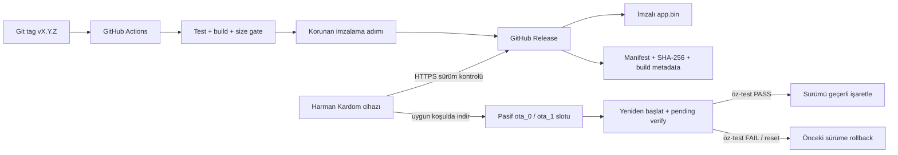

# OTA ve sürüm yönetimi planı

## Hedef

Harman Kardom cihazları, kararlı bir firmware GitHub Release olarak yayımlandıktan sonra güncellemeyi internet üzerinden otomatik olarak bulur, güvenli koşullarda indirir, kullanılmayan OTA slotuna yazar, yeniden başlatır ve açılış öz-testinden sonra sürümü onaylar. Başarısız açılışta önceki çalışan imaja geri döner.

F7 aşamasında manifest doğrulayıcı, güncelleme kapıları, OTA istemcisi, imzalama profili ve etiket/yayın hattı yazıldı ve ana makinede doğrulandı. Durum yine de `planned`: **hiçbiri cihaz üzerinde çalıştırılmadı**, donanım henüz elde değil ve otomatik güncelleme G6 kanıtı olmadan tamamlanmış sayılmaz. Bu belgede "yazıldı" ile "kanıtlandı" ayrı tutulur.

## Mimari



## Kabul edilmiş ürün davranışı

- Sürüm biçimi SemVer ve Git etiketi olarak `vMAJOR.MINOR.PATCH` olur.
- Normal cihazlar yalnız yayımlanmış, prerelease olmayan ve kendi donanım kimliğiyle eşleşen daha yeni sürüme geçer.
- Güncelleme kontrolü Wi-Fi hazır olduktan sonra rastgele gecikmeyle ve ardından en fazla günde bir yapılır; dört cihazın aynı anda GitHub'a ve Wi-Fi ağına yük bindirmesi önlenir.
- Oynatma sırasında indirme/yazma başlatılmaz. Aktif ses bittiğinde uygun pencereye ertelenir.
- Düşük batarya, yüksek sıcaklık, kararsız Wi-Fi veya başka OTA devam ediyorsa güncelleme ertelenir.
- OTA boyunca RGB LED camgöbeği yanıp söner; hata halinde hızlı kırmızı, başarılı yeniden açılışta üç saniye yeşil gösterir.
- Kullanıcı ayarları ve `factory_cal` app slotlarından ayrı NVS bölümlerinde tutulur; şema göçleri geriye uyumlu ve testli olur.
- İlk sürümde bootloader ve partition table uzaktan güncellenmez; yalnız uygulama imajı OTA edilir.
- USB/UART fiziksel kurtarma yolu her sürümde korunur.

## Güncellemenin başlayabilmesi için kapılar

| Kontrol | Başlangıç politikası | Kesinleşme |
|---|---|---|
| Ses durumu | AirPlay/audio durmuş ve buffer boş | Firmware entegrasyon testi |
| Batarya | `OTA_MIN_PACK_MV` üstü; değer G3/G4 ölçümüyle belirlenecek | Güç kalibrasyonu |
| Sıcaklık | NTC güvenli aralıkta | BMS/NTC modeli ve G4 |
| Dosya boyutu | Pasif OTA slotuna sığıyor | CI size gate |
| Donanım | Manifest `target` ve `hw_revision` eşleşiyor | Kart seçimi |
| Sürüm | Uzak SemVer yerelden büyük | Birim testi |
| Güvenlik | HTTPS sertifika doğrulaması ve imzalı image geçerli | G6 |

Batarya yüzdesi yalnız paket geriliminden kesinmiş gibi hesaplanmaz. İlk eşik, dinlenmiş paket gerilimi/yük telemetrisi ölçümleriyle belirlenir; ölçüm yoksa OTA başlamaz.

## ESP32-S3 partition ve rollback taslağı

Kesin boyutlar firmware, ses kütüphaneleri ve seçilen flash kapasitesi ölçüldükten sonra kilitlenir. Zorunlu yapı:

- `nvs`: kullanıcı ayarları.
- `nvs_keys`: NVS encryption anahtarları kullanılırsa.
- `factory_cal`: sürücü koruma ve donanım kalibrasyonu; kullanıcı reseti silmez. Ad 11 karakterdir: ESP-IDF partition etiketini 16, NVS namespace adını 15 karakterle sınırlar, bu yüzden daha uzun bir ad sessizce kırpılır.
- Flash bütçesi [[../07-decisions/ADR-0010-esp32-s3-n16r8-board|ADR-0010]] ile 16 MB varsayımına dayanır.
- `otadata`: ESP-IDF OTA seçimi için `0x2000` veri bölümü.
- `ota_0` ve `ota_1`: eşit boyutlu iki uygulama slotu.
- Opsiyonel `factory/recovery`: flash alanı ve kurtarma stratejisi onaylanırsa salt okunur kurtarma imajı.

Yeni image ilk açılışta `pending verify` kabul edilir. Aşağıdakiler geçmeden `esp_ota_mark_app_valid_cancel_rollback()` çağrılmaz:

1. NVS sürümü ve migration doğrulaması.
2. Wi-Fi başlatma ve kayıtlı ağa bağlanma veya kontrollü provisioning fallback.
3. I2S/DAC/audio task başlatma ve watchdog sağlığı.
4. Güç/NTC telemetrisinin geçerli aralıkta okunması.
5. En az 30 saniyelik kritik hata/reset olmadan çalışma.

Kritik öz-test hatasında `esp_ota_mark_app_invalid_rollback_and_reboot()` kullanılır. Enerji kesintisi; indirme, flash yazma, `otadata` değişimi ve ilk açılışın her aşamasında G6 kapsamında fiziksel olarak test edilir.

## GitHub Actions release hattı

### Pull request / branch CI

1. Sabitlenmiş ESP-IDF toolchain sürümünü kur.
2. Format, statik analiz ve host birim testlerini çalıştır.
3. Firmware'i unsigned CI imajı olarak derle.
4. Partition/uygulama boyutu sınırını denetle.
5. Build raporu ve kısa ömürlü workflow artifact üret; Release oluşturma.

### `v*.*.*` etiketi release hattı

`.github/workflows/release.yml`, üç iş: `verify` → `build` → `publish`.

1. **verify** — `check_docs`, ana makine birim testleri, araç testleri ve depo değişmezleri (`check_partitions`, `check_storage_isolation`, `check_no_credential_logs`).
2. **build** — `sdkconfig.defaults` + `sdkconfig.release` ile derler. **İmzalama anahtarını görmez.** Ayrıca sürüm profilinin gerçekten imza istediğini ve anti-rollback'in kapalı kaldığını üretilen `sdkconfig` üzerinden doğrular; bu seçenek sessizce kapansaydı başka hiçbir şey fark etmezdi. Boyut kapısı burada çalışır.
3. **publish** — `release` ortamına bağlıdır ve `contents: write` iznini yalnız bu iş alır. Ortam **kapsamı** gerçek: `HK_SIGNING_KEY` ortam secret'ıdır ve depo secret'ı sayısı sıfırdır, yani `build` işi anahtarı okuyamaz. Ortamda **zorunlu inceleyici yoktur** — private depoda koruma kuralları ücretli plan istiyor — dolayısıyla etiket push'u insan onayı olmadan yayımlar. Görüntüyü `espsecure.py sign_data --version 2` ile imzalar, imzayı geri doğrular, manifest'i **imzalanmış** dosyadan üretir, manifest ile ikilinin uyuştuğunu bir kez daha okuyup karşılaştırır, sonra release'i oluşturur.

Anahtar yönetiminin tamamı [[../credentials/signing-keys|imzalama anahtarları kaydında]]. Özeti:

- Şu an depoda bir **geliştirme** anahtarı var (`docs/credentials/hk-dev-signing-key.pem`). Depo public olduğu için o anahtar tasarım gereği açıktır ve `publish` işi onunla imzalamayı **reddeder**.
- Gerçek anahtar henüz üretilmedi; gidecek güvenli bir yer yok (depo public, `release` ortamı mevcut değil, `admin` yetkisi yok).
- Üretildiğinde çevrimdışı üretilir, açık yarısı `firmware/certs/hk-signing-key.pub.bin` olarak sabitlenir ve özel yarısı `release` **ortam** secret'ında yaşar.

Bölünmenin nedeni: `CONFIG_SECURE_BOOT_BUILD_SIGNED_BINARIES=n` sayesinde derleme anahtarsız başarılı olur — ESP-IDF'in kendisi "App built but not signed. Sign app before flashing" der. Böylece CI'ya dokunan bir değişiklik anahtara ulaşamaz.

Bu, `release` ortamının **korunmuş olmasına** bağlıdır ve şu an değildir: ortam hiç yok, ilk etiket onu korumasız yaratır. Ayrıntı ve sahibinin yapması gerekenler ADR-0008 §6'da ve risk kaydında.

`publish` işi imzalamadan önce iki şeyi denetler:

1. Anahtarın açık yarısının parmak izi `docs/credentials/burned-keys.txt` içindeyse **reddeder**. Liste konum değil parmak izi üzerinden çalışır: bir anahtar dosyasını silmek onu ifşa edilmemiş yapmaz, çünkü geçmişte durur.
2. Sabitlenmiş `firmware/certs/hk-signing-key.pub.bin` ile eşleşmiyorsa **reddeder**. İmzayı imzalayan anahtarla doğrulamak hiçbir şey kanıtlamaz; her geçerli RSA-3072 anahtarı o denetimden geçer. Önemli olan cihazların **zaten güvendiği** anahtar olup olmadığıdır, çünkü güven çıpası çalışan uygulamanın kendi imza bloğudur. Yanlış ama geçerli bir anahtarla yayımlanan sürümü dört hoparlör de sessizce reddeder ve kurtarma yolu dört cihazı USB'den yeniden yazmaktır.

Üretici ile aygıt yazılımının **değerler** üzerinde anlaştığı ayrıca doğrulanıyor. Önceden yalnız alan **adları** karşılaştırılıyordu; bir değer uyuşmazlığı (ayrıştırıcının farklı yazdığı bir sürüm, yanlış kutuda bir özet, taşan bir boyut, tampona sığmayan bir URL) tüm test paketinden geçer ve dört hoparlörün her sürümü reddetmesiyle keşfedilirdi.

Bunun için JSON ayrıştırma ESP-IDF katmanından çıkarılıp saf C'ye taşındı (`hk_manifest_json.c`); cJSON zaten bağımsız C99. Artık `build/host-tests/manifest_e2e` gerçek üretilmiş bir manifest'i gerçek ayrıştırıcıdan ve gerçek doğrulayıcıdan geçiriyor ve cihazın ne karar vereceğini yazdırıyor.

Manifest'in imzalı dosyadan üretilmesi zorunludur: imzalama görüntüyü sektör sınırına doldurur ve 4096 baytlık imza sektörü ekler, yani imzasız ikiliden üretilen manifest yanlış boyut ve özet taşır ve her cihaz reddeder.

`prerelease` canary doğrulamasından sonra **aynı imzalı asset** stable'a terfi ettirilir; yeniden derlenmez.

## Release asset sözleşmesi

`v0.1.0` release içeriği:

```text
harman-kardom.bin          imzalı uygulama imajı
manifest.json              cihazın okuduğu sürüm tanımı
bootloader.bin             yalnız USB kurtarma için; OTA ile gönderilmez
partition-table.bin        yalnız USB kurtarma için; OTA ile gönderilmez
```

Manifest `firmware/tools/make_manifest.py` tarafından üretilir. `product`, `version` ve `secure_version` komut satırından **alınmaz**, imzalı ikilinin uygulama tanımlayıcısından okunur; böylece manifest ile görüntünün çelişmesi ifade edilemez. Etiket ise doğrulanır: `v0.3.0` etiketiyle 0.2.0 derlemesi yayımlanamaz.

Gerçek çıktı (0.1.0 sürüm profili derlemesinden, 2026-08-31):

```json
{
  "asset": "https://github.com/OWNER/REPO/releases/download/v0.1.0/harman-kardom.bin",
  "channel": "stable",
  "hw_revision": "prototype-n16r8",
  "min_updater_version": "0.1.0",
  "product": "harman-kardom",
  "secure_version": 0,
  "sha256": "6092fad9b8ae75e2e5fe819fefc2b0f924870e64efee68f27b216dc04c9dc24b",
  "size": 1126400,
  "target": "esp32s3",
  "version": "0.1.0"
}
```

`product` alanı ikilinin `project_name`'idir, yani `harman-kardom` — ürün adının insan okur biçimi (`Harman Kardom`) değil. Cihaz bu ikisini karşılaştırdığı için biçim serbest değildir.

OTA istemcisi dosya adı yerine manifestteki `target`/`hw_revision` alanlarını doğrular. `size`, `sha256` ve `secure_version` CI tarafından üretilir; elde düzenlenmez.

Manifest'teki `sha256` alanı hakkında dürüst olmak gerekir: **cihaz onu hesaplayıp karşılaştırmaz.** Biçimi (64 küçük harf onaltılık) doğrulanır ve yayın işi imzalı ikiliye karşı denetler, ama indirilen baytların bütünlüğü cihazda ESP-IDF'in kendi eklediği SHA-256 ile sağlanır: `esp_https_ota_finish` → `esp_ota_end` → `esp_image_verify` (`esp_ota_ops.c:459`). Sürüm profilinde buna imza doğrulaması da eklenir. Manifest özeti bu yüzden insan ve CI içindir, cihazın güven zinciri değildir.

## `esp_ghota` değerlendirmesi: reddedildi (2026-08-31)

Spike yapıldı ve aday elendi. Karar ve kanıt [[../07-decisions/ADR-0008-github-releases-ota|ADR-0008]] içindedir; özet:

| Kriter | Bulgu |
|---|---|
| Bakım | Son commit 2024-02-17, 2,5 yıl önce. Üç açık issue, üçü de yanıtsız. |
| ESP-IDF uyumu | CI matrisi en fazla v5.2. Bu proje v5.5.1'de. |
| Kurulabilirlik | README'nin kendi komutu çalışmıyor; `fishwaldo/ghota` kayıtta yok, `fishwaldo/esp_ghota` yalnız 0.0.1. |
| Mimari | Donanım eşleşmesini `fnmatch` ile **dosya adından** yapıyor, manifest kavramı yok. Bu planın kuralının tam tersi. |
| Lisans | MIT; sorun değil. |

G6 kabul matrisinin dört satırı kütüphanenin çekirdeği yeniden yazılmadan sağlanamıyor. Bu planın öngördüğü yedek yol işletildi: `esp_https_ota` üstünde küçük bir istemci yazıldı.

## Yazılan istemci

| Modül | Ne yapar | Nerede test edilir |
|---|---|---|
| `hk_manifest` | Manifest'i **tek bayt indirmeden** yargılar: ürün, hedef, donanım, kanal, SemVer, kesin yenilik, sha256 biçimi, boyut ≤ yuva | Ana makine |
| `hk_gate` | Güncellemenin şimdi başlayabilir mi olduğunu söyler. Kalibrasyon yoksa `HK_GATE_NO_LIMITS` ile engeller | Ana makine |
| `hk_ota` (saf C) | İnen görüntünün tanımlayıcısını manifest'in vaadiyle karşılaştırır; varlık URL'sini denetler | Ana makine |
| `hk_health` (saf C) | İlk açılışta imajın onaylanıp onaylanmayacağına karar verir: onayla, geri al, ya da bekle | Ana makine |
| `hk_ota_client` | HTTPS, JSON, `esp_https_ota` döngüsü. Yukarıdakileri doğru sırayla çağırır | Yalnız derleme; çalışma G6'yı bekler |

Sıralama tasarımın kendisidir: manifest **indirmeden önce**, kapılar **soket açılmadan önce**, görüntü tanımlayıcısı **açılış bölümü taşınmadan önce** yargılanır.

`hk_ota_image_check()` neden var: ESP-IDF v5.5.1 `esp_https_ota_get_img_desc` yalnız `magic_word` denetler ve `project_name`'i OTA yolunda hiç karşılaştırmaz. Başka bir projenin doğru derlenmiş ESP32-S3 görüntüsü IDF'in tüm denetimlerinden geçer. Bu karşılaştırma onu yakalayan tek yerdir.

## Dört cihaz için dağıtım

1. `prerelease/canary`: yalnız bir test hoparlörüne manuel olarak aday kanal atanır.
2. Canary; yeniden başlatma, Wi-Fi, AirPlay, I2S, NVS migration ve 2 saat çalışma testinden geçer.
3. Release stable olarak terfi ettirilir.
4. Diğer üç cihaz rastgele gecikmeyle otomatik günceller; hepsi aynı anda yeniden başlamaz.
5. Her cihaz yerel olarak son başarılı sürüm, son hata kodu ve rollback sayacını saklar; parola/token içermez.

## G6 kabul matrisi

| Senaryo | Beklenen sonuç |
|---|---|
| Geçerli yeni sürüm | İndir, yeni slota yaz, öz-test, valid |
| Aynı/eski SemVer | Güncelleme yok |
| Yanlış target/hardware | Asset reddedilir |
| Bozuk hash veya imza | Image boot seçimine alınmaz |
| Düşük batarya / yüksek sıcaklık | Ertele, cihaz çalışmaya devam eder |
| Oynatma aktif | Ertele; audio kesilmez |
| İndirme/flash sırasında enerji kesintisi | Önceki image açılır |
| İlk boot öz-test hatası/reset | Otomatik rollback |
| NVS migration hatası | Eski şema korunur veya rollback |
| GitHub erişilemiyor/rate limit | Backoff; normal çalışma sürer |
| Dört cihaz stable rollout | Rastgele gecikme, sürüm tutarlılığı |
| USB/UART recovery | Belgelenmiş fiziksel kurtarma başarılı |

Her satır [[../templates/test-report|test raporu]] ile kanıtlanır. G6 geçmeden “otomatik güncelleme hazır” denmez.

## İmzalama, geri alma ve sertifika kararları

Üçü de [[../07-decisions/ADR-0008-github-releases-ota|ADR-0008]]'de gerekçesiyle kayıtlıdır. Buradaki özet işletim içindir:

- **İmzalama** `CONFIG_SECURE_SIGNED_APPS_NO_SECURE_BOOT` ile yapılır ve **hiçbir eFuse yakmaz**; geri alınabilir. Kapsamı sınırlıdır: imza yalnız OTA anında doğrulanır, açılışta değil (ESP32-S3'te açılış doğrulaması yalnız Secure Boot V1 donanımında var, S3'te yok). Uzaktan sahte güncellemeye karşı korur, fiziksel erişime karşı korumaz.
- Bu yüzden imzalama ayarı `sdkconfig.defaults` içinde **değildir**, `sdkconfig.release` içindedir. Açık olsaydı imzasız bir geliştirme yapısı açılışta `abort()` ederdi (`esp_efuse_startup.c:103` → `esp_secure_boot_init_checks()`), yani düz `idf.py flash` boot döngüsü verirdi.
- **Anti-rollback (`CONFIG_BOOTLOADER_APP_ANTI_ROLLBACK`) kapalıdır ve öyle kalır.** eFuse yakar, ESP32-S3'te ömür boyu 16 artış hakkı vardır ve geri alınamaz. `secure_version` yalnız yazılımsal karşılaştırılır.
- **Sertifika paketi**: GitHub'ın sürüm varlık sunucusu `ISRG Root YR` altındadır ve o kök ESP-IDF v5.5.1 paketinde **yoktur**. Bugün yalnız çapraz imza sayesinde çalışıyor. Kök `firmware/certs/isrg-root-yr.pem` olarak eklendi; gerekçesi ve ölçümü `firmware/certs/README.md` içinde. **2032-09-02'de dolar, öncesinde yenilenmeli.**

## Uygulama iş listesi

Yazıldı ve ana makinede doğrulandı:

- [x] Firmware framework/ESP-IDF sürümünü kilitle (v5.5.1).
- [x] `esp_ghota` uyumluluk spike'ı — reddedildi, yerine kendi istemcimiz.
- [x] OTA partition CSV ve size budget.
- [x] Firmware version/build metadata modülü (`hk_version`).
- [x] Manifest parser ve donanım eşleme testleri (`hk_manifest`).
- [x] Güç/thermal/audio update gate state machine (`hk_gate`).
- [x] İnen görüntünün manifest ile karşılaştırılması (`hk_ota`).
- [x] HTTPS indirme istemcisi (`hk_ota_client`) — derleniyor, çalıştırılmadı.
- [x] GitHub Actions PR CI.
- [x] SemVer tag release, imzalama, manifest üretimi ve asset yükleme.

Açık:

- [ ] Progress event ve LED entegrasyonu (`hk_led` OTA durumu tanımlı, istemciye bağlanmadı).
- [ ] İlk-boot health check ve `esp_ota_mark_app_valid_cancel_rollback()` çağrısı. `CONFIG_BOOTLOADER_APP_ROLLBACK_ENABLE` bu çağrı yazılana kadar **kapalı** kalır; açık olsaydı yayımlanan her imaj ilk yeniden başlatmada geri döner ve güncelleme hiç tutmazdı. İkisi aynı değişiklikte açılır ve yayın hattı bunu denetler.
- [x] Güncelleme zamanlayıcısı (`hk_sched`): rastgele ilk gecikme, günlük aralık + jitter, ikiye katlanan ve tavanlanan backoff. Rastgelelik **enjekte**, üretici çağrılmıyor; 32-bit milisaniye sarması işaretli farkla ele alınıyor.
- [ ] Canary/stable kanal politikasının işletilmesi.
- [x] USB/UART kurtarma prosedürü ve betiği ([[usb-recovery]], `firmware/tools/recover.py`). Tam silme yerine cerrahi yazma: ofsetler `partitions.csv`'den okunuyor ve korunan bölüme taşma denetleniyor. Cihazda **çalıştırılmadı**; `G6`'nın son satırı.
- [x] Depo `ktahatastan`'a taşındı ve `private` yapıldı.
- [x] Gerçek `HK_SIGNING_KEY` çevrimdışı üretildi, açık yarısı `firmware/certs/hk-signing-key.pub.bin` olarak sabitlendi, özel yarısı `release` **ortam** secret'ında. İlk anahtar yandı ve `burned-keys.txt` ile kalıcı reddediliyor.
- [ ] `release` ortamına zorunlu inceleyici — private depoda ücretli plan istiyor (`HTTP 422`). Onay kapısı yok; risk kaydında.
- [ ] G6 enerji kesintisi ve rollback testleri — **donanım bekliyor**.

## Kaynaklar

- [esp_ghota deposu](https://github.com/Fishwaldo/esp_ghota) — GitHub Releases OTA adayı; erişim 2026-08-30.
- [ESP-IDF OTA ve rollback](https://docs.espressif.com/projects/esp-idf/en/v5.5/esp32s3/api-reference/system/ota.html) — A/B slot, pending verify ve rollback; erişim 2026-08-30.
- [ESP-IDF ESP32-S3 partition tabloları](https://docs.espressif.com/projects/esp-idf/en/release-v5.3/esp32s3/api-guides/partition-tables.html) — `otadata`, `ota_0`, `ota_1`; erişim 2026-08-30.
- [ESP32-S3 Secure Boot v2](https://docs.espressif.com/projects/esp-idf/en/stable/esp32s3/security/secure-boot-v2.html) — imzalı image ve anahtar yönetimi; erişim 2026-08-30.
- [GitHub Releases](https://docs.github.com/en/repositories/releasing-projects-on-github/about-releases) ve [otomatik release notes](https://docs.github.com/en/repositories/releasing-projects-on-github/automatically-generated-release-notes) — release asset dağıtımı; erişim 2026-08-30.
- ESP-IDF v5.5.1 kaynak ağacı, F7 kararlarının birincil dayanağı: `components/bootloader/Kconfig.projbuild` (imzalama seçenekleri), `components/bootloader_support/src/secure_boot.c` (imzasız uygulamada `abort()`), `components/esp_https_ota/src/esp_https_ota.c:589-594` (yalnız magic word denetimi), `components/mbedtls/esp_crt_bundle/cacrt_all.pem` (150 kök, ISRG Root YR yok); okuma 2026-08-31.
- Kullanıcının verdiği ek uygulama örnekleri: [GitHub Actions ile ESP32 release](https://www.smartlab.at/an-automated-ci-cd-pipeline-to-build-and-release-your-esp32-firmware-with-github-actions/) ve [SPIFFS/GitHub Actions örneği](https://blog.r0b.io/post/deploying-esp32-with-spiffs-using-github-actions/); erişim 2026-08-30.

