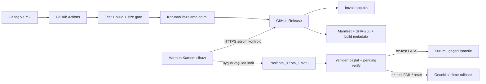

# OTA ve sürüm yönetimi planı

## Hedef

Harman Kardom cihazları, kararlı bir firmware GitHub Release olarak yayımlandıktan sonra güncellemeyi internet üzerinden otomatik olarak bulur, güvenli koşullarda indirir, kullanılmayan OTA slotuna yazar, yeniden başlatır ve açılış öz-testinden sonra sürümü onaylar. Başarısız açılışta önceki çalışan imaja geri döner.

Bu özellik henüz uygulanmış değildir. Firmware projesi oluşturulmadığı için durum `planned`; otomatik güncelleme G6 kanıtı olmadan tamamlanmış sayılmaz.

## Mimari



## Kabul edilmiş ürün davranışı

- Sürüm biçimi SemVer ve Git etiketi olarak `vMAJOR.MINOR.PATCH` olur.
- Normal cihazlar yalnız yayımlanmış, prerelease olmayan ve kendi donanım kimliğiyle eşleşen daha yeni sürüme geçer.
- Güncelleme kontrolü Wi-Fi hazır olduktan sonra rastgele gecikmeyle ve ardından en fazla günde bir yapılır; dört cihazın aynı anda GitHub'a ve Wi-Fi ağına yük bindirmesi önlenir.
- Oynatma sırasında indirme/yazma başlatılmaz. Aktif ses bittiğinde uygun pencereye ertelenir.
- Düşük batarya, yüksek sıcaklık, kararsız Wi-Fi veya başka OTA devam ediyorsa güncelleme ertelenir.
- OTA boyunca RGB LED camgöbeği yanıp söner; hata halinde hızlı kırmızı, başarılı yeniden açılışta üç saniye yeşil gösterir.
- Kullanıcı ayarları ve `factory_cal` app slotlarından ayrı NVS bölümlerinde tutulur; şema göçleri geriye uyumlu ve testli olur.
- İlk sürümde bootloader ve partition table uzaktan güncellenmez; yalnız uygulama imajı OTA edilir.
- USB/UART fiziksel kurtarma yolu her sürümde korunur.

## Güncellemenin başlayabilmesi için kapılar

| Kontrol | Başlangıç politikası | Kesinleşme |
|---|---|---|
| Ses durumu | AirPlay/audio durmuş ve buffer boş | Firmware entegrasyon testi |
| Batarya | `OTA_MIN_PACK_MV` üstü; değer G3/G4 ölçümüyle belirlenecek | Güç kalibrasyonu |
| Sıcaklık | NTC güvenli aralıkta | BMS/NTC modeli ve G4 |
| Dosya boyutu | Pasif OTA slotuna sığıyor | CI size gate |
| Donanım | Manifest `target` ve `hw_revision` eşleşiyor | Kart seçimi |
| Sürüm | Uzak SemVer yerelden büyük | Birim testi |
| Güvenlik | HTTPS sertifika doğrulaması ve imzalı image geçerli | G6 |

Batarya yüzdesi yalnız paket geriliminden kesinmiş gibi hesaplanmaz. İlk eşik, dinlenmiş paket gerilimi/yük telemetrisi ölçümleriyle belirlenir; ölçüm yoksa OTA başlamaz.

## ESP32-S3 partition ve rollback taslağı

Kesin boyutlar firmware, ses kütüphaneleri ve seçilen flash kapasitesi ölçüldükten sonra kilitlenir. Zorunlu yapı:

- `nvs`: kullanıcı ayarları.
- `nvs_keys`: NVS encryption anahtarları kullanılırsa.
- `factory_cal`: sürücü koruma ve donanım kalibrasyonu; kullanıcı reseti silmez. Ad 11 karakterdir: ESP-IDF partition etiketini 16, NVS namespace adını 15 karakterle sınırlar, bu yüzden daha uzun bir ad sessizce kırpılır.
- Flash bütçesi [[../07-decisions/ADR-0010-esp32-s3-n16r8-board|ADR-0010]] ile 16 MB varsayımına dayanır.
- `otadata`: ESP-IDF OTA seçimi için `0x2000` veri bölümü.
- `ota_0` ve `ota_1`: eşit boyutlu iki uygulama slotu.
- Opsiyonel `factory/recovery`: flash alanı ve kurtarma stratejisi onaylanırsa salt okunur kurtarma imajı.

Yeni image ilk açılışta `pending verify` kabul edilir. Aşağıdakiler geçmeden `esp_ota_mark_app_valid_cancel_rollback()` çağrılmaz:

1. NVS sürümü ve migration doğrulaması.
2. Wi-Fi başlatma ve kayıtlı ağa bağlanma veya kontrollü provisioning fallback.
3. I2S/DAC/audio task başlatma ve watchdog sağlığı.
4. Güç/NTC telemetrisinin geçerli aralıkta okunması.
5. En az 30 saniyelik kritik hata/reset olmadan çalışma.

Kritik öz-test hatasında `esp_ota_mark_app_invalid_rollback_and_reboot()` kullanılır. Enerji kesintisi; indirme, flash yazma, `otadata` değişimi ve ilk açılışın her aşamasında G6 kapsamında fiziksel olarak test edilir.

## GitHub Actions release hattı

### Pull request / branch CI

1. Sabitlenmiş ESP-IDF toolchain sürümünü kur.
2. Format, statik analiz ve host birim testlerini çalıştır.
3. Firmware'i unsigned CI imajı olarak derle.
4. Partition/uygulama boyutu sınırını denetle.
5. Build raporu ve kısa ömürlü workflow artifact üret; Release oluşturma.

### `v*.*.*` etiketi release hattı

1. Etiketin SemVer olduğunu ve firmware `PROJECT_VER` ile eşleştiğini doğrula.
2. Temiz checkout'ta test ve tekrarlanabilir release build çalıştır.
3. Uygulama imajını korunan imzalama ortamında imzala.
4. SHA-256, boyut, ESP-IDF/toolchain sürümü, commit SHA, `target`, `hw_revision`, `secure_version` ve kanal bilgisi içeren manifest üret.
5. GitHub Release ve otomatik release notes oluştur.
6. Release asset'lerini yükle; yükleme ve checksum doğrulanmadan release'i yayımlama.
7. Prerelease canary doğrulamasından sonra aynı imzalı asset'i stable olarak terfi ettir; yeniden build etme.

Release job yalnız gerekli kapsamla `contents: write` izni alır. İmzalama özel anahtarı repoya, firmware'e, workflow artifact'ine veya loglara yazılmaz. Prototipte GitHub protected environment secret değerlendirilebilir; üretimde uzak imzalama/HSM tercih edilir.

## Release asset sözleşmesi

Örnek `v1.0.0` release içeriği:

```text
harman-kardom-esp32s3-n16r8-v1.0.0.bin
harman-kardom-esp32s3-n16r8-v1.0.0.manifest.json
harman-kardom-esp32s3-n16r8-v1.0.0.sha256
release-notes.md
```

Manifestte en az şu alanlar bulunur:

```json
{
  "product": "Harman Kardom",
  "version": "1.0.0",
  "channel": "stable",
  "target": "esp32s3",
  "hw_revision": "prototype-n16r8",
  "asset": "harman-kardom-esp32s3-n16r8-v1.0.0.bin",
  "size": 0,
  "sha256": "TBD_BY_CI",
  "secure_version": 0,
  "min_updater_version": "0.1.0",
  "commit": "TBD_BY_CI"
}
```

`size`, hash ve commit CI tarafından üretilir; elde düzenlenmez. OTA istemcisi dosya adı yerine manifestteki target/hardware alanlarını doğrular.

## `esp_ghota` değerlendirmesi

`esp_ghota`; GitHub Releases üzerinden SemVer denetimi, firmware/filesystem asset indirme, periyodik veya manuel kontrol ve ESP-IDF rollback/anti-rollback ile çalışma özellikleri sunduğu için birinci uygulama adayıdır.

Kabul öncesi spike görevleri:

- Seçilecek ESP-IDF ve AirPlay yığınıyla build uyumluluğunu kanıtla.
- TLS sertifika doğrulaması, redirect davranışı ve GitHub API hata/rate-limit durumlarını test et.
- Audio task çalışırken heap/PSRAM, flash yazma süresi ve Wi-Fi bant kullanımını ölç.
- Private-repo tokenını firmware'e gömme. Release kaynağı kimlik doğrulama istiyorsa cihaz başına güvenli kimlik veya ayrı OTA servisi tasarla.
- Bağımlılığı kesin commit/sürümle sabitle, lisans ve bakım durumunu kaydet.

Spike başarısızsa ESP-IDF `ESP HTTPS OTA` ile küçük bir release-manifest istemcisi yazılır. GitHub Releases dağıtım kararı korunur; yalnız istemci kütüphanesi değişir.

## Dört cihaz için dağıtım

1. `prerelease/canary`: yalnız bir test hoparlörüne manuel olarak aday kanal atanır.
2. Canary; yeniden başlatma, Wi-Fi, AirPlay, I2S, NVS migration ve 2 saat çalışma testinden geçer.
3. Release stable olarak terfi ettirilir.
4. Diğer üç cihaz rastgele gecikmeyle otomatik günceller; hepsi aynı anda yeniden başlamaz.
5. Her cihaz yerel olarak son başarılı sürüm, son hata kodu ve rollback sayacını saklar; parola/token içermez.

## G6 kabul matrisi

| Senaryo | Beklenen sonuç |
|---|---|
| Geçerli yeni sürüm | İndir, yeni slota yaz, öz-test, valid |
| Aynı/eski SemVer | Güncelleme yok |
| Yanlış target/hardware | Asset reddedilir |
| Bozuk hash veya imza | Image boot seçimine alınmaz |
| Düşük batarya / yüksek sıcaklık | Ertele, cihaz çalışmaya devam eder |
| Oynatma aktif | Ertele; audio kesilmez |
| İndirme/flash sırasında enerji kesintisi | Önceki image açılır |
| İlk boot öz-test hatası/reset | Otomatik rollback |
| NVS migration hatası | Eski şema korunur veya rollback |
| GitHub erişilemiyor/rate limit | Backoff; normal çalışma sürer |
| Dört cihaz stable rollout | Rastgele gecikme, sürüm tutarlılığı |
| USB/UART recovery | Belgelenmiş fiziksel kurtarma başarılı |

Her satır [[../templates/test-report|test raporu]] ile kanıtlanır. G6 geçmeden “otomatik güncelleme hazır” denmez.

## Uygulama iş listesi

- [ ] Firmware framework/ESP-IDF sürümünü kilitle.
- [ ] `esp_ghota` uyumluluk ve kaynak kullanımı spike'ı.
- [ ] OTA partition CSV ve size budget.
- [ ] Firmware version/build metadata modülü.
- [ ] Manifest parser ve donanım eşleme testleri.
- [ ] Güç/thermal/audio update gate state machine.
- [ ] HTTPS indirme, progress event ve LED entegrasyonu.
- [ ] İlk-boot health check ve rollback.
- [ ] GitHub Actions PR CI.
- [ ] SemVer tag release, imzalama, SHA-256 ve asset yükleme.
- [ ] Canary/stable kanal politikası.
- [ ] USB/UART recovery prosedürü.
- [ ] G6 enerji kesintisi ve rollback testleri.

## Kaynaklar

- [esp_ghota deposu](https://github.com/Fishwaldo/esp_ghota) — GitHub Releases OTA adayı; erişim 2026-08-30.
- [ESP-IDF OTA ve rollback](https://docs.espressif.com/projects/esp-idf/en/v5.5/esp32s3/api-reference/system/ota.html) — A/B slot, pending verify ve rollback; erişim 2026-08-30.
- [ESP-IDF ESP32-S3 partition tabloları](https://docs.espressif.com/projects/esp-idf/en/release-v5.3/esp32s3/api-guides/partition-tables.html) — `otadata`, `ota_0`, `ota_1`; erişim 2026-08-30.
- [ESP32-S3 Secure Boot v2](https://docs.espressif.com/projects/esp-idf/en/stable/esp32s3/security/secure-boot-v2.html) — imzalı image ve anahtar yönetimi; erişim 2026-08-30.
- [GitHub Releases](https://docs.github.com/en/repositories/releasing-projects-on-github/about-releases) ve [otomatik release notes](https://docs.github.com/en/repositories/releasing-projects-on-github/automatically-generated-release-notes) — release asset dağıtımı; erişim 2026-08-30.
- Kullanıcının verdiği ek uygulama örnekleri: [GitHub Actions ile ESP32 release](https://www.smartlab.at/an-automated-ci-cd-pipeline-to-build-and-release-your-esp32-firmware-with-github-actions/) ve [SPIFFS/GitHub Actions örneği](https://blog.r0b.io/post/deploying-esp32-with-spiffs-using-github-actions/); erişim 2026-08-30.

